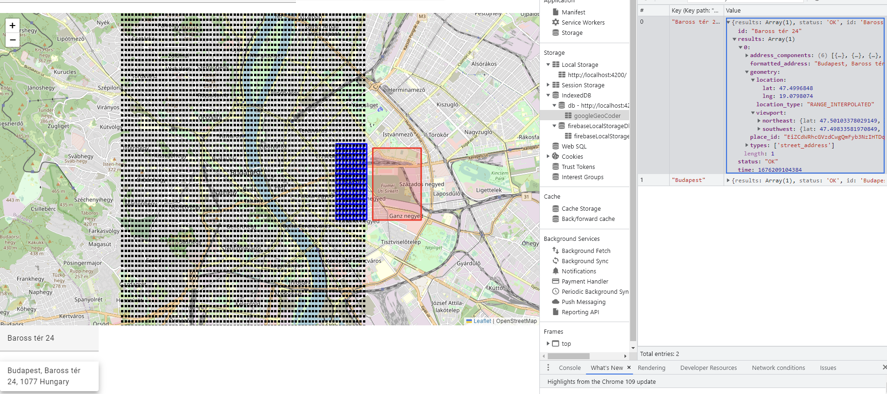
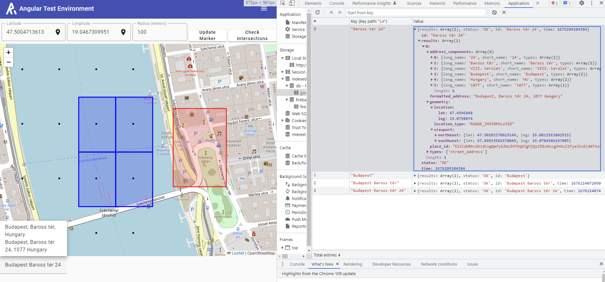

# MapProject

This is an example project how can we create Leaflet Maps, using calculations, creating components in Angular 15.




## Gettings started

After you downloaded the project copy config.ts.example to config.ts and modify its content according to your configuration.

When you finished run the following command to install dependencies:

```bash
npm install
```

## Development server

Run `ng serve` for a dev server. Navigate to `http://localhost:4200/`. The application will automatically reload if you change any of the source files.

## Roadmap

Since the base components, pages and Services are ready the practice plan is the following:
 - Integrating more Google Cloud APIs
 - Layer management on the map



## Code scaffolding

Run `ng generate component component-name` to generate a new component. You can also use `ng generate directive|pipe|service|class|guard|interface|enum|module`.

## Build

Run `ng build` to build the project. The build artifacts will be stored in the `dist/` directory.

## Running unit tests

Run `ng test` to execute the unit tests via [Karma](https://karma-runner.github.io).

## Running end-to-end tests

Run `ng e2e` to execute the end-to-end tests via a platform of your choice. To use this command, you need to first add a package that implements end-to-end testing capabilities.

## Further help

To get more help on the Angular CLI use `ng help` or go check out the [Angular CLI Overview and Command Reference](https://angular.io/cli) page.
